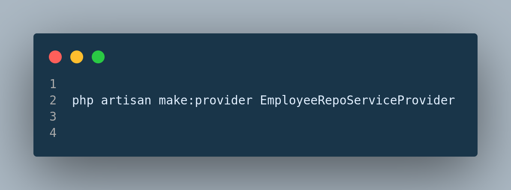
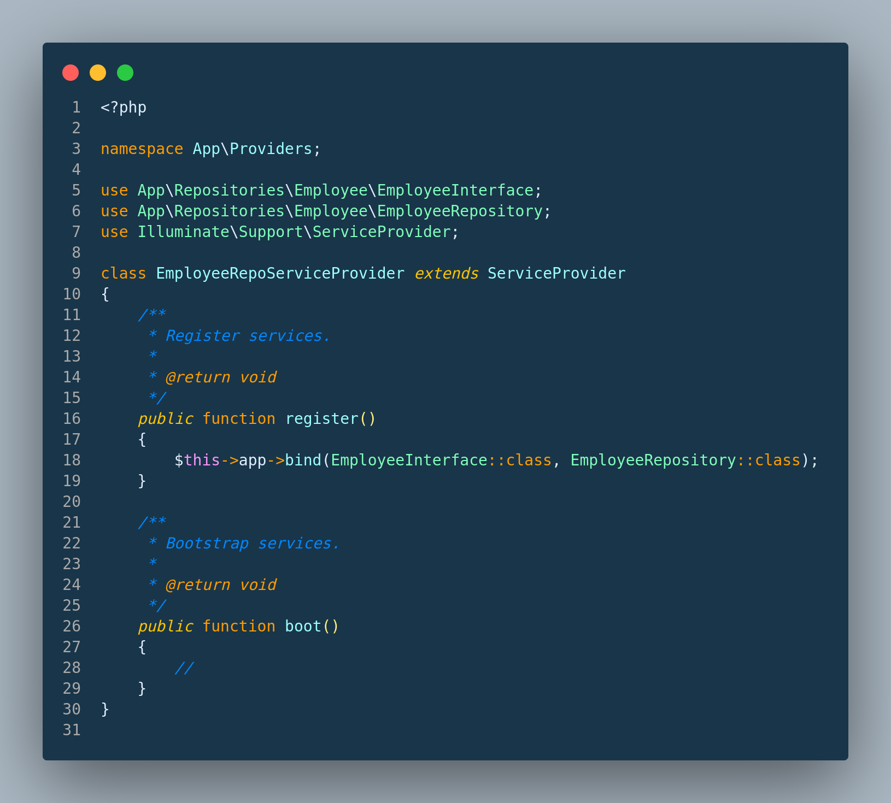
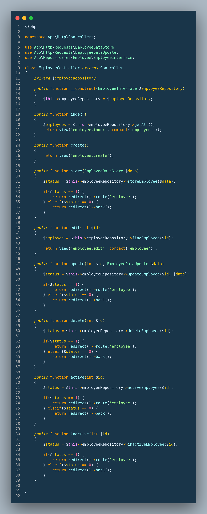

    <a href="https://github.com/tauhedulislam0001/Laravel-Repository-Binding" target="_blank">
         Laravel Repository Pattern Tutorial from scratch
    </a>

## About Laravel Repository Pattern

In this laravel application I want to share with you, how to create Repository Pattern in Laravel 10 application. Generally we are getting data directly from model, I mean we are use just MVC. But if you have big application then it is better way if you use Repository Pattern. I will give you few step to create Repository Pattern. normally we use directly from Model but if you make Repository Pattern for every module then it is good way to develop laravel application.

## Step 1: Create Interface

In first step we have to create Interface, before create Repositories (app/Repositories) directory in app folder. Also we need top create 'Employee' (app/Repositories/Employee) folder inside Repositories folder.

Ok, now first we will create EmployeeInterface in Employee directory, so first create EmployeeInterface.php file and put bellow code in that file:

### app/Repositories/Employee/EmployeeInterface.php

## Step 2: Create Repository

Ok, in this step we will create UserRepository.php for write database login, in this file we will write our database login code. so, first create UserRepository.php file in User directory and put bellow code.

### app/Repositories/Employee/EmployeeRepository.php

## Step 3: Bind Repository In App Service Provider
Next, we can create Service Provider for Employees, and we can also work with App Service Provider. But It's good if we separate every module's service provider for good practice. Create service provider by this command 

Next, you need to add to bind EmployeeRepositoryInterface and EmployeeRepository in app/Providers/EmployeeRepoServiceProvider.php

## Step 4: Add Repository Design Pattern In EmployeeController

Now in this step, we have to create EmployeeController to implement our all of the method to create a complete laravel CRUD application using repository design pattern

## Step 5: Create view file for Crud
Everything are set to go. We have to just create our view then we can test our first repository pattern application with crud.
